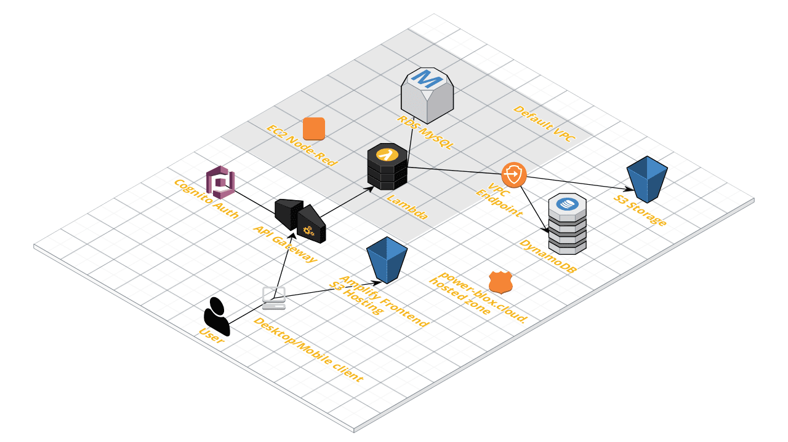
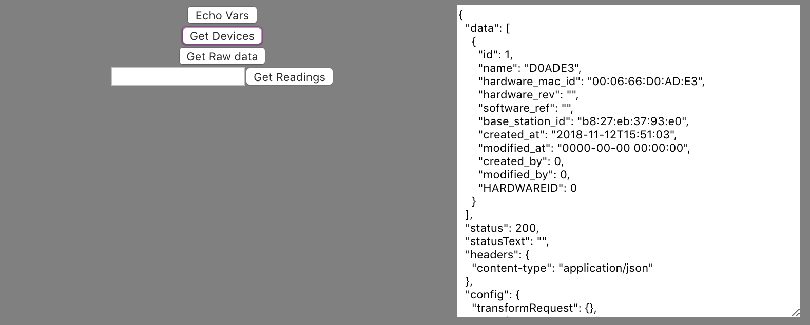
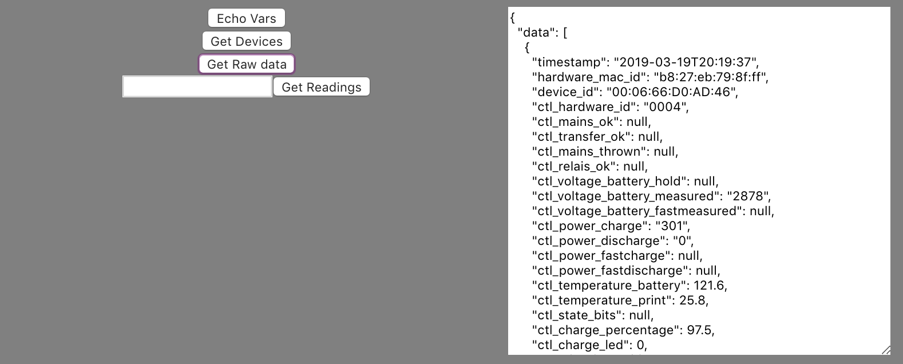

# Power-Blox infrastructure setup

This README covers a basic walk through for the Power-Blox infrastructure and codebase setup

## Requirements

refer to [initial setup document](docs/initial-setup.md) for requirements

after you have installed all requirements, you can simply type:

```bash
make
```

to see the list of available commands

## Secrets

All passwords and keys you may need to access and change the infrastructure are stored in a [Keybase](https://keybase.io/) team shared filesystem, providing full end-to-end encryption for security. It's recommended that you install the software and create an account (free) if you don't have one already, then ask your administrator details on how to access it.

# Overview

All infrastructure is deployed in the **eu-west-1** region (Ireland), Terraform can be easily updated with a parameter to recreate the infrastructure in a different region. Below is a simplified representation of the current deployment:



# Deploy

## Infrastructure

to create / update / destroy the infrastructure, refer to the [terraform](docs/terraform.md) docs, this is configured as follows (all references to folders are relative to `infrastucture`):

- Cognito user pool and client for both user and programmatic authentication, in the `auth` folder
- API Gateway with a single `{proxy+}` resource attached to the Cognito authentication system and relative deployment and DNS records, in the `apigw` folder
- **MySQL** Database server on RDS with multi-zone availability and automatic daily backup, and **DynamoDB** NoSQL table with id+sort keys presets, everything in the `db` folder
- two S3 buckets (one for storage and one for logging), in the `storage` folder
- a Lambda function with attached **roles and policies** to gain access to the databases and S3 buckets, in the `api` folder. After updating the code, the new package is created using makefile and deployed via terraform
- some Route53 DNS records for the `.power-blox.cloud.` hosted zone, used for easier access to the API Gateway and EC2 prototype instance (read below)
- a prototype instance on EC2 running node-red and hooked to the [p01.power-blox.cloud](http://p01.power-blox.cloud:1880) DNS record
- an export file used for the automatic configuration of the frontend, to get access to the correct Cognito user pool and client, [here](./frontend/readings/src/aws-resources.dev.js)

for the testing frontend, please refer to specific section below


## Database schema & migrations

### DynamoDB

there is currently a single DynamoDB table managed by Terraform, its definition is stored [here](./infrastructure/db/dynamo.tf) and defining just 2 main attributes `DeviceId` for **hash_key** and `ReadingRange` for **range_key**

```hcl
  attribute = [{
    name = "DeviceId"
    type = "S"
  }, {
    name = "ReadingRange"
    type = "S"
  }]
```

A python script can be used to generate some random data according to this format, [here](./script/generate_readings.py)

Please refer to AWS Documentation for further optimisations, this might be a good [starting point](https://aws.amazon.com/blogs/database/choosing-the-right-dynamodb-partition-key/).

### MySQL

The database schema is defined using [liquibase](https://www.liquibase.org/), its configuration is stored in the `liquibase` folder. When changing the database, a new change set must be defined in the `changeSets` subfolder, then migrations are run.

the liquibase script for database migrations **must run from a server that has access to RDS** (i.e. within the vpc and/or defined security groups), it's accessible via the makefile

```bash
make migrate
```

the initial migration is extremely simple and defined for demonstration purposes, [here](./liquibase/changeSets/000-initial-change-set.xml) at the moment just creating a single table

```sql
create table devices (
  id bigint auto_increment primary key not null,
  name varchar(255)
);
```

we encourage (!) to **add migrations to liquibase** in the supported changeSet format so that the schema can be managed by the code.

**PLEASE NOTE!** if the database schema is changed manually, this will create inconsistencies with the migration tool and won't be manageable via the codebase!

## Lambda Backend

a simple backend is exposed via lambda and authenticated through the API gateway with Cognito. To create a distributable package, just type:

```bash
make lambda-readings
```

the updated package is then deployed running the terraform script described in their specific sections above (via `terraform init`)

**PLEASE NOTE!** before building the archive for deployment with the make command above, make sure to create a `.env` file containing the right db credential, this can be done copying the template `cd lambda/readings/ && cp .env.template .env` and filling it with values.

## Frontend

the frontend is presently published on a S3 bucket [here](http://readings-20181030115713--hostingbucket.s3-website-eu-west-1.amazonaws.com/)

**PLEASE NOTE!** access to the Frontend is authenticated via Cognito! if you want to get access to it, create a user in the User pool.

the frontend can be easily published by running

```bash
make publish
```

but for all options offered by [aws amplify](https://aws-amplify.github.io/), cd into `frontend/readings` and type `amplify`

### Demo API

These are the API calls implemented in the Lambda backend that can be invoked by the Frontend

**/echo_vars**: shows the environment variables used by the Lambda function (DynamoDB table and MySQL endpoint)

**/devices**: reads content from MySQL reporting a list of rows stored in the `devices` table



**/readings/{device_id}** reads content from DynamoDB reporting all data stored in the past 15 days for the specific `{device_id}` in the path


